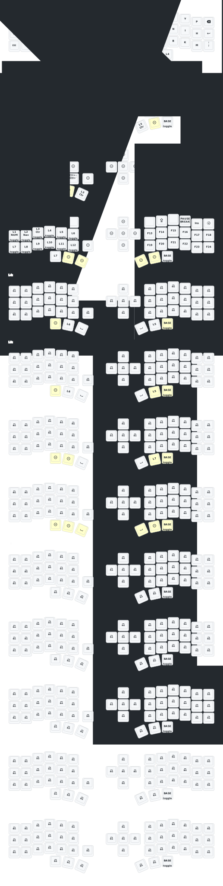

# (Eyelash Peripherals) Corne ZMK Repository

> **Warning**: Do not fork this repo, fork the upstream if you need it

**This keyboard is not the same as [foostan's Corne](https://github.com/foostan/crkbd). It will not work with standard `corne` firmware.**

<!-- If you need a 3D model of this keyboard, email `380465425@qq.com`.

**If you already have a ZMK config repository, [you can add this one as a module instead of forking](https://zmk.dev/docs/features/modules#building-with-modules).** -->

## Keymap Diagram

